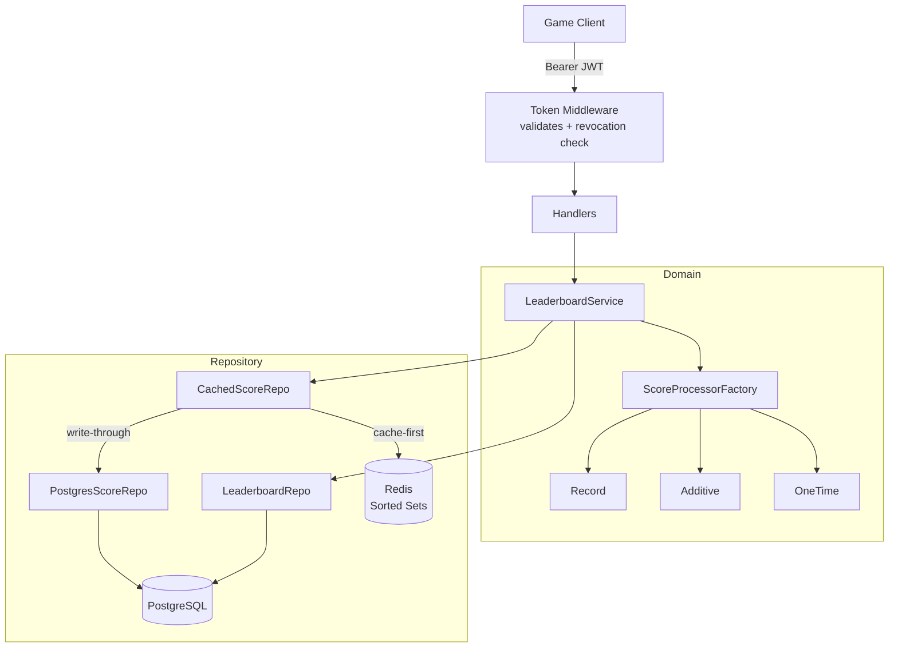

# Leaderboard Service

[](https://github.com/AmirSff-Go/leaderboard-service/actions/workflows/ci.yml)
[](https://golang.org)
[](LICENSE)

A production-ready, horizontally scalable leaderboard backend written in Go. Designed for game centers that need real-time rankings across multiple games and leaderboard types — with Redis-powered caching, JWT-based game isolation, and Kubernetes-native deployment.

---

## Features

- **Multiple leaderboard types** — Record (personal best), Additive (cumulative score), OneTime (first submission only)
- **Time-windowed periods** — daily, weekly, or any custom interval via a single `interval_seconds` field; all-time with `0`
- **Redis sorted sets** — O(log N) score upserts and rank lookups; cache-first reads with automatic Postgres fallback and warm-up
- **Write-through caching** — Postgres is always the source of truth; Redis failure is non-fatal
- **JWT game authentication** — each game gets its own signed token; tokens are revocable via `token_version` in the DB
- **Graceful shutdown** — handles SIGTERM with a 25s drain window; safe for rolling Kubernetes deployments
- **Health probes** — `/health/live` and `/health/ready` for Kubernetes liveness and readiness checks
- **Hexagonal architecture** — domain layer has zero infrastructure dependencies; easy to swap storage backends

---

## Architecture



**Request flow for score submission:**
1. Middleware validates JWT signature and checks `token_version` against DB (revocation)
2. Service fetches the leaderboard and computes the current `duration_index` (time bucket)
3. `ScoreProcessorFactory` selects the right processor for the leaderboard type
4. Processor decides whether to save and what the final score is
5. Postgres is written first (source of truth), then Redis sorted set is updated

---

## Tech Stack

| Layer | Technology |
|-------|-----------|
| HTTP framework | [Echo v4](https://echo.labstack.com) |
| Database | PostgreSQL 14+ |
| Cache | Redis 7+ (sorted sets) |
| Auth | JWT (golang-jwt/jwt/v5) |
| Container | Docker (distroless image) |
| Orchestration | Kubernetes |

---

## Quick Start

### Prerequisites

- Go 1.23+
- Docker and Docker Compose

### Run locally

```bash
# 1. Clone the repository
git clone https://github.com/AmirSff-Go/leaderboard-service.git
cd leaderboard-service

# 2. Start PostgreSQL and Redis
docker compose up -d

# 3. Configure environment
cp .env.example .env
# Edit .env with your values

# 4. Run database migrations
go run ./cmd/migrate

# 5. Start the server
go run ./cmd/server
```

The server starts on `http://localhost:8080`.

---

## API Reference

### Authentication

All leaderboard endpoints require a `Bearer` token obtained when registering a game.

Admin endpoints require an `admin_password` field in the request body.

---

### Admin Endpoints

#### Register a game

```bash
curl -X POST http://localhost:8080/admin/games \
  -H "Content-Type: application/json" \
  -d '{
    "admin_password": "your-admin-password",
    "game_name": "Space Shooter",
    "game_desc": "A classic arcade shooter"
  }'
```

```json
{
  "id": "550e8400-e29b-41d4-a716-446655440000",
  "name": "Space Shooter",
  "token": "eyJhbGciOiJIUzI1NiIsInR5cCI6IkpXVCJ9..."
}
```

#### Revoke and reissue a game token

```bash
curl -X POST http://localhost:8080/admin/games/{id}/refresh-token \
  -H "Content-Type: application/json" \
  -d '{"admin_password": "your-admin-password"}'
```

#### Update game details

```bash
curl -X PATCH http://localhost:8080/admin/games/{id} \
  -H "Content-Type: application/json" \
  -d '{
    "admin_password": "your-admin-password",
    "game_name": "Space Shooter 2"
  }'
```

---

### Leaderboard Endpoints

All endpoints below require `Authorization: Bearer <token>`.

#### Create a leaderboard

```bash
curl -X POST http://localhost:8080/leaderboards \
  -H "Authorization: Bearer <token>" \
  -H "Content-Type: application/json" \
  -d '{
    "unique_name": "weekly-highscore",
    "description": "Weekly high score board",
    "type": "record",
    "interval_seconds": 604800
  }'
```

**Leaderboard types:**

| Type | Behaviour |
|------|-----------|
| `record` | Keeps the user's personal best score |
| `additive` | Accumulates all submissions (total XP, total kills) |
| `onetime` | Only the first submission is recorded |

**Period configuration:**

| `interval_seconds` | Period |
|-------------------|--------|
| `0` | All-time |
| `86400` | Daily |
| `604800` | Weekly |
| any value | Custom interval |

Periods reset automatically — no cron jobs needed. The service computes which time bucket a submission belongs to at write time.

#### Submit a score

```bash
curl -X POST http://localhost:8080/leaderboards/weekly-highscore/scores \
  -H "Authorization: Bearer <token>" \
  -H "Content-Type: application/json" \
  -d '{
    "user_id": "user_123",
    "score": 4850
  }'
```

#### Get rankings

```bash
curl "http://localhost:8080/leaderboards/weekly-highscore/rankings?page=1&page_size=10&user_id=user_123"
```

```json
{
  "rankings": [
    { "rank": 1, "user_id": "user_456", "score": 9200 },
    { "rank": 2, "user_id": "user_123", "score": 4850 },
    { "rank": 3, "user_id": "user_789", "score": 3100 }
  ],
  "total": 3,
  "page": 1,
  "page_size": 10,
  "user_entry": { "rank": 2, "user_id": "user_123", "score": 4850 }
}
```

Pass `duration_index` explicitly to query a specific historical period.

---

### Health Endpoints

| Endpoint | Use |
|----------|-----|
| `GET /health/live` | Kubernetes liveness probe |
| `GET /health/ready` | Kubernetes readiness probe — checks DB and Redis connectivity |

```json
{ "db": "ok", "redis": "ok" }
```

---

## Configuration

| Variable | Required | Default | Description |
|----------|----------|---------|-------------|
| `DATABASE_URL` | yes | — | PostgreSQL connection string |
| `REDIS_URL` | yes | — | Redis connection string |
| `JWT_SECRET` | yes | — | Secret key for signing game tokens |
| `ADMIN_PASSWORD` | yes | — | Password for admin endpoints |
| `SERVER_PORT` | no | `8080` | HTTP port |

Copy `.env.example` to `.env` to get started.

> **Note:** If Redis is unavailable at startup, the service degrades gracefully to Postgres-only mode. No manual intervention needed.

---

## Running Tests

```bash
# Run all unit tests
go test ./...

# With race detector
go test ./... -race

# Specific package
go test ./internal/domain/... -v
```

73 unit tests covering the domain layer, all HTTP handlers, and authentication middleware. Tests use in-memory fakes — no database or Redis required.

---

## Deployment

### Docker

```bash
docker build -t leaderboard-service .
docker run -p 8080:8080 --env-file .env leaderboard-service
```

The image is built on `gcr.io/distroless/static` — no shell, non-root user, minimal attack surface.

### Kubernetes

Configure liveness and readiness probes in your Deployment:

```yaml
livenessProbe:
  httpGet:
    path: /health/live
    port: 8080
  initialDelaySeconds: 5
  periodSeconds: 10

readinessProbe:
  httpGet:
    path: /health/ready
    port: 8080
  initialDelaySeconds: 5
  periodSeconds: 10
```

The server handles `SIGTERM` with a 25-second graceful shutdown window — set `terminationGracePeriodSeconds: 30` in your Pod spec.

---

## License

MIT — see [LICENSE](LICENSE).
