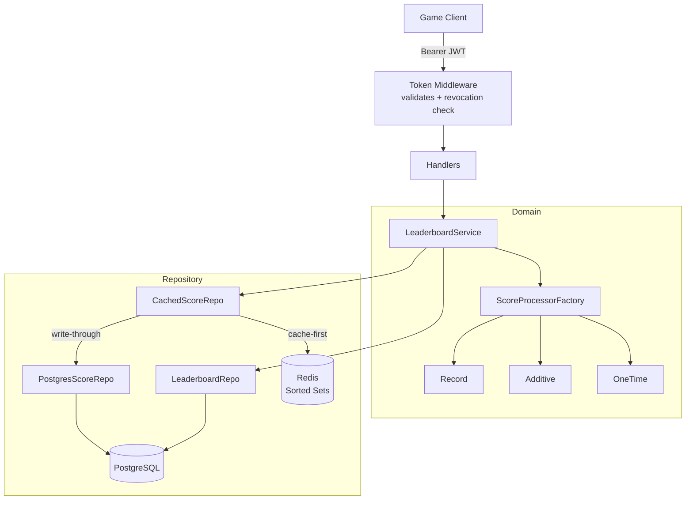
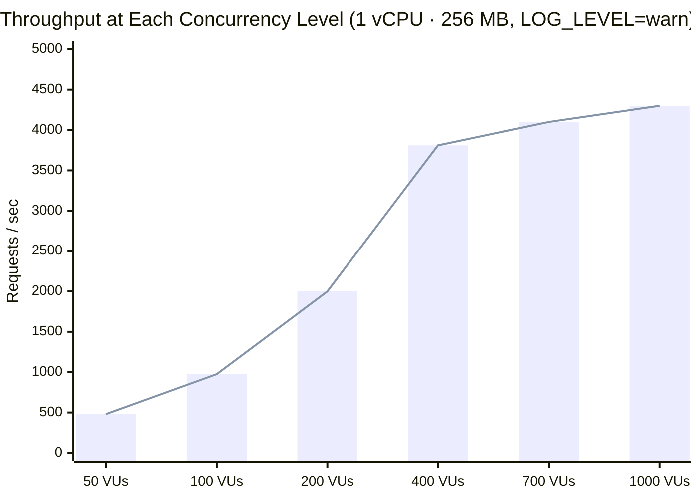
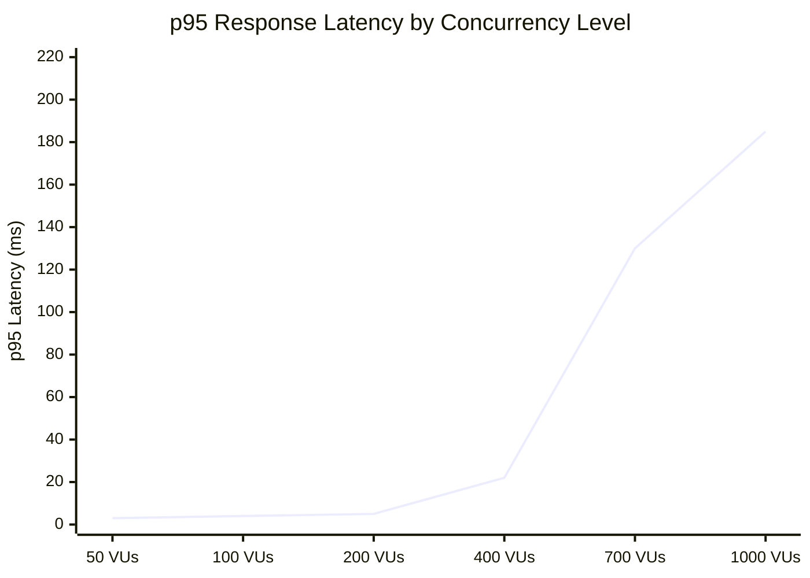

# Leaderboard Service

[](https://github.com/AmirSff-Go/leaderboard-service/actions/workflows/ci.yml)
[](https://golang.org)
[](LICENSE)

A production-ready, horizontally scalable leaderboard backend written in Go. Designed for game centers that need real-time rankings across multiple games and leaderboard types — with Redis-powered caching, JWT-based game isolation, and Kubernetes-native deployment.

---

## Features

- **Multiple leaderboard types** — Record (personal best), Additive (cumulative score), OneTime (first submission only)
- **Time-windowed periods** — daily, weekly, or any custom interval via a single `interval_seconds` field; all-time with `0`
- **Redis sorted sets** — O(log N) score upserts and rank lookups; cache-first reads with automatic Postgres fallback and warm-up
- **Write-through caching** — Postgres is always the source of truth; Redis failure is non-fatal
- **JWT game authentication** — each game gets its own signed token; tokens are revocable via `token_version` in the DB
- **Graceful shutdown** — handles SIGTERM with a 25s drain window; safe for rolling Kubernetes deployments
- **Health probes** — `/health/live` and `/health/ready` for Kubernetes liveness and readiness checks
- **Hexagonal architecture** — domain layer has zero infrastructure dependencies; easy to swap storage backends

---

## Architecture



**Request flow for score submission:**
1. Middleware validates JWT signature and checks `token_version` against DB (revocation)
2. Service fetches the leaderboard and computes the current `duration_index` (time bucket)
3. `ScoreProcessorFactory` selects the right processor for the leaderboard type
4. Processor decides whether to save and what the final score is
5. Postgres is written first (source of truth), then Redis sorted set is updated

---

## Tech Stack

| Layer | Technology |
|-------|-----------|
| HTTP framework | [Echo v4](https://echo.labstack.com) |
| Database | PostgreSQL 14+ |
| Cache | Redis 7+ (sorted sets) |
| Auth | JWT (golang-jwt/jwt/v5) |
| Container | Docker (distroless image) |
| Orchestration | Kubernetes |

---

## API Documentation

Interactive Swagger UI is available two ways:

### Live (same port as the app)

Set `SWAGGER_ENABLED=true` in `.env`, then start the server. The UI is served on the same port as the API — no extra port needed:

```
http://localhost:8080/swagger/index.html
```

Use the **Authorize** button (🔒) to paste your game JWT (`Bearer <token>`) once. All leaderboard endpoints will carry it automatically. This is disabled by default in production (`SWAGGER_ENABLED=false`).

### GitHub Pages (static, always-on)

Every push to `master` regenerates the spec and deploys a read-only Swagger UI to GitHub Pages. To enable it:

1. Go to **Settings → Pages** in your GitHub repo
2. Set Source to **GitHub Actions**
3. Push — the `API Docs → GitHub Pages` workflow handles the rest

The published URL will be `https://<org>.github.io/<repo>/`.

> The static page documents all endpoints but the "Try it out" button is disabled — it only works against a running server.

---

## Quick Start

### Prerequisites

- Go 1.26+
- Docker and Docker Compose

### Run locally

```bash
# 1. Clone the repository
git clone https://github.com/AmirSff-Go/leaderboard-service.git
cd leaderboard-service

# 2. Start PostgreSQL and Redis
docker compose up -d

# 3. Configure environment
cp .env.example .env
# Edit .env with your values

# 4. Run database migrations
go run ./cmd/migrate

# 5. Start the server
go run ./cmd/server
```

The server starts on `http://localhost:8080`.

---

## API Reference

### Authentication

All leaderboard endpoints require a `Bearer` token obtained when registering a game.

Admin endpoints require an `admin_password` field in the request body.

---

### Admin Endpoints

#### Register a game

```bash
curl -X POST http://localhost:8080/admin/games \
  -H "Content-Type: application/json" \
  -d '{
    "admin_password": "your-admin-password",
    "game_name": "Space Shooter",
    "game_desc": "A classic arcade shooter"
  }'
```

```json
{
  "id": "550e8400-e29b-41d4-a716-446655440000",
  "name": "Space Shooter",
  "token": "eyJhbGciOiJIUzI1NiIsInR5cCI6IkpXVCJ9..."
}
```

#### Revoke and reissue a game token

```bash
curl -X POST http://localhost:8080/admin/games/{id}/refresh-token \
  -H "Content-Type: application/json" \
  -d '{"admin_password": "your-admin-password"}'
```

#### Update game details

```bash
curl -X PATCH http://localhost:8080/admin/games/{id} \
  -H "Content-Type: application/json" \
  -d '{
    "admin_password": "your-admin-password",
    "game_name": "Space Shooter 2"
  }'
```

---

### Leaderboard Endpoints

All endpoints below require `Authorization: Bearer <token>`.

#### Create a leaderboard

```bash
curl -X POST http://localhost:8080/leaderboards \
  -H "Authorization: Bearer <token>" \
  -H "Content-Type: application/json" \
  -d '{
    "unique_name": "weekly-highscore",
    "description": "Weekly high score board",
    "type": "record",
    "interval_seconds": 604800
  }'
```

**Leaderboard types:**

| Type | Behaviour |
|------|-----------|
| `record` | Keeps the user's personal best score |
| `additive` | Accumulates all submissions (total XP, total kills) |
| `onetime` | Only the first submission is recorded |

**Period configuration:**

| `interval_seconds` | Period |
|-------------------|--------|
| `0` | All-time |
| `86400` | Daily |
| `604800` | Weekly |
| any value | Custom interval |

Periods reset automatically — no cron jobs needed. The service computes which time bucket a submission belongs to at write time.

#### Submit a score

```bash
curl -X POST http://localhost:8080/leaderboards/weekly-highscore/scores \
  -H "Authorization: Bearer <token>" \
  -H "Content-Type: application/json" \
  -d '{
    "user_id": "user_123",
    "score": 4850
  }'
```

#### Get rankings

```bash
curl "http://localhost:8080/leaderboards/weekly-highscore/rankings?page=1&page_size=10&user_id=user_123"
```

```json
{
  "rankings": [
    { "rank": 1, "user_id": "user_456", "score": 9200 },
    { "rank": 2, "user_id": "user_123", "score": 4850 },
    { "rank": 3, "user_id": "user_789", "score": 3100 }
  ],
  "total": 3,
  "page": 1,
  "page_size": 10,
  "user_entry": { "rank": 2, "user_id": "user_123", "score": 4850 }
}
```

Pass `duration_index` explicitly to query a specific historical period.

---

### Health Endpoints

| Endpoint | Use |
|----------|-----|
| `GET /health/live` | Kubernetes liveness probe |
| `GET /health/ready` | Kubernetes readiness probe — checks DB and Redis connectivity |

```json
{ "db": "ok", "redis": "ok" }
```

---

## Configuration

| Variable | Required | Default | Description |
|----------|----------|---------|-------------|
| `DATABASE_URL` | yes | — | PostgreSQL connection string |
| `REDIS_URL` | yes | — | Redis connection string |
| `JWT_SECRET` | yes | — | Secret key for signing game tokens |
| `ADMIN_PASSWORD` | yes | — | Password for admin endpoints |
| `SERVER_PORT` | no | `8080` | HTTP port |

Copy `.env.example` to `.env` to get started.

> **Note:** If Redis is unavailable at startup, the service degrades gracefully to Postgres-only mode. No manual intervention needed.

---

## Running Tests

```bash
# Run all unit tests
go test ./...

# With race detector
go test ./... -race

# Specific package
go test ./internal/domain/... -v
```

73 unit tests covering the domain layer, all HTTP handlers, and authentication middleware. Tests use in-memory fakes — no database or Redis required.

---

## Deployment

### Docker

```bash
docker build -t leaderboard-service .
docker run -p 8080:8080 --env-file .env leaderboard-service
```

The image is built on `gcr.io/distroless/static` — no shell, non-root user, minimal attack surface.

### Kubernetes

Configure liveness and readiness probes in your Deployment:

```yaml
livenessProbe:
  httpGet:
    path: /health/live
    port: 8080
  initialDelaySeconds: 5
  periodSeconds: 10

readinessProbe:
  httpGet:
    path: /health/ready
    port: 8080
  initialDelaySeconds: 5
  periodSeconds: 10
```

The server handles `SIGTERM` with a 25-second graceful shutdown window — set `terminationGracePeriodSeconds: 30` in your Pod spec.

---

## Performance

> [!NOTE]
> All results below were measured under **hard resource constraints**: the service container was limited to **1 vCPU · 256 MB RAM** via Docker's `--cpus` and `--memory` flags. PostgreSQL 16 and Redis 7 ran unconstrained on the same host.

### Test Environment

| Component | Details |
|-----------|---------|
| Load tool | Grafana k6 v2.0.0 |
| **Server limits** | **1 vCPU · 256 MB RAM** (Docker resource cap) |
| Database | PostgreSQL 16-alpine |
| Cache | Redis 7-alpine |
| Pre-seeded entries | 500 leaderboard entries |
| Traffic mix | 70% GET rankings (cache-hit) · 20% POST score · 10% GET rankings + user rank |

### Load Profile

The test ramped from 50 to **1,000 virtual users** across 6 stages, holding each level for 40–60 seconds to reach a stable measurement window.

| Stage | Duration | VUs | Observation |
|-------|----------|-----|-------------|
| Warm-up | 20 s → 40 s hold | 50 | Baseline |
| Level 1 | 20 s → 40 s hold | 100 | Linear scaling |
| Level 2 | 20 s → 40 s hold | 200 | Linear scaling |
| Level 3 | 20 s → 40 s hold | 400 | CPU ceiling begins |
| Level 4 | 20 s → 40 s hold | 700 | Plateau |
| **Peak** | **20 s → 60 s hold** | **1,000** | **Sustained max load** |
| Wind-down | 30 s | 0 | — |

---

### Throughput vs Concurrency



Throughput scales **linearly** from 50 → 200 VUs then plateaus at ≈ **4,100–4,300 req/s** — the 1-vCPU ceiling. Inflection point is at approximately **~380–420 VUs / ~3,800 req/s**.

---

### p95 Latency vs Concurrency



Latency stays under **5 ms p95** through 200 VUs. Above ~400 VUs, queue depth grows as the single CPU saturates — latency rises but **the error rate stays at 0%**.

---

### Full Run Results — 1,000 VU Peak

| Metric | Result |
|--------|--------|
| **Total requests** | **1,106,292** |
| **Total duration** | 6 min 50 s |
| **Error rate** | **0.00%** |
| Overall avg throughput | 2,910 req/s |
| **Peak throughput** | **~4,300 req/s** |
| p50 latency (all) | 23 ms |
| p90 latency (all) | 149 ms |
| **p95 latency (all)** | **185 ms** |
| p95 GET rankings | 188 ms |
| p95 POST score | 164 ms |
| Max observed latency | 1.44 s |
| Data received | 972 MB |
| Data sent | 423 MB |

### Threshold Summary

| Threshold | Limit | Measured | Result |
|-----------|-------|----------|--------|
| HTTP error rate | < 5% | **0.00%** | ✅ PASS |
| p95 request duration | < 2,000 ms | **185 ms** | ✅ PASS |
| p95 ranking duration | < 1,000 ms | **188 ms** | ✅ PASS |

---

### Impact of Access Logging on Performance

Per-request access logs (`LOG_LEVEL=verbose`) compete for CPU cycles at high throughput — at ~4,000 req/s that's ~4,000 `fmt.Fprintf` calls/sec just for logging. The table below shows both runs under identical conditions.

| Metric | `LOG_LEVEL=verbose` | `LOG_LEVEL=warn` | Δ |
|--------|--------------------|--------------------|---|
| Total requests (6m50s) | 1,022,729 | **1,106,292** | +8% |
| Avg throughput | 2,695 req/s | **2,910 req/s** | +8% |
| Peak throughput (1k VUs) | ~3,900 req/s | **~4,300 req/s** | +10% |
| p95 latency | 211 ms | **185 ms** | −12% |
| p95 ranking | 217 ms | **188 ms** | −13% |
| Error rate | 0.00% | 0.00% | — |

> Disable access logging in production (`LOG_LEVEL=warn` or `LOG_LEVEL=error`). Use `LOG_LEVEL=verbose` in development when you need per-request traces.

---

### Key Findings

- **Linear scaling up to ~400 VUs.** Throughput grows proportionally with concurrency up to the 1-vCPU cap. Adding a second replica would double this to ~8,600 req/s.
- **Zero errors across 1,106,292 requests.** The service never returns 4xx/5xx under load — it queues excess requests rather than dropping them.
- **Cache dominance keeps reads fast.** 80% of traffic is cache-first GET rankings served from Redis sorted sets, keeping p95 under 5 ms at low concurrency.
- **Saturation point: ~380–420 VUs / ~3,800 req/s.** Above this level, throughput is flat and latency grows proportionally with queue depth — a classic CPU-bound bottleneck.
- **Access logging costs ~10–13% throughput at peak.** Use `LOG_LEVEL=warn` in production; reserve `verbose` for development and debugging.
- **Memory is not the constraint.** The service runs comfortably within 256 MB even at 1,000 VUs; scaling up RAM alone would not improve throughput.
- **Horizontal scaling is the lever.** Each additional replica adds ~4,300 req/s to the ceiling with identical latency characteristics.

---

### Running the Stress Test

```bash
cd stress-test

# Build images and bring up the full stack (Postgres + Redis + service)
docker compose build
docker compose up -d --wait

# Run k6 — ramps to 1,000 VUs over ~7 minutes
docker compose --profile test run --rm k6
```

Results are written to `stress-test/k6/summary.json` after each run.

---

## License

MIT — see [LICENSE](LICENSE).
